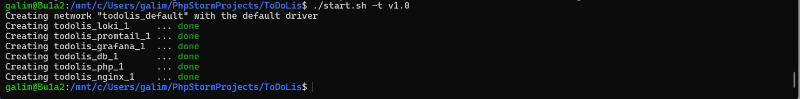
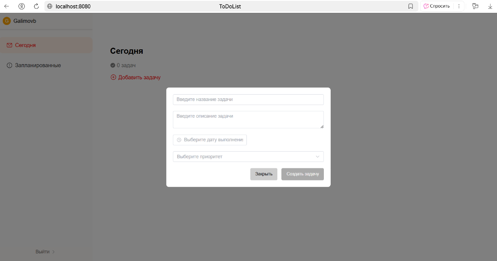
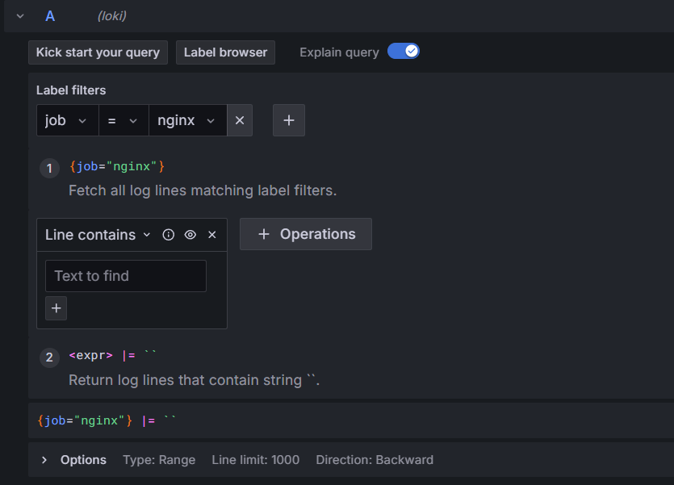
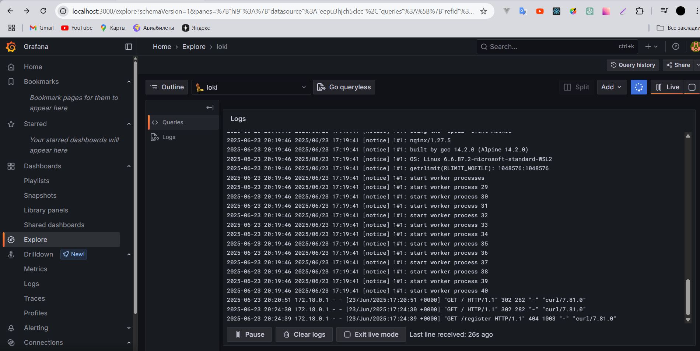

# Запаковать ваше любое веб приложение в контейнеры с использованием compose/minikube
* обеспечить логирование вашего приложения в "централизованное хранилище" (loki/elasticksearch/clickhouse или любой продукт на выбор не из списка, главное чтобы поддерживался как источник данных в grafana)
* сделать возможность просмотров ваших логов через grafana
* сборка зависимостей кода должна быть описана через multistage если зависимости имеются
* сборка и развертывание контейнеров должно быть реализовано через bash скрипты. Скрипты должны иметь параметр запуска -t который задает тег образа который будет собран или запущен

##  Описание приложения

Приложение ToDoList(приложение, где создаются задачи, отмечается выполнение, видно какие задачи по дням)

- Backend Symfony
- Frontend Vue3(монтируется с помощью WebpackEncore в Twig)
- БД Postgres


---

## Этапы работы:

**Сборка с помощью скрипта:**
```bash
./build.sh -t v1.0
```


**Деплой с помощью скрипта:**
```bash
./start.sh -t v1.0
```



## Проверка работы:
**Скрин работающего приложения**


## Логирование:


Сами логи

